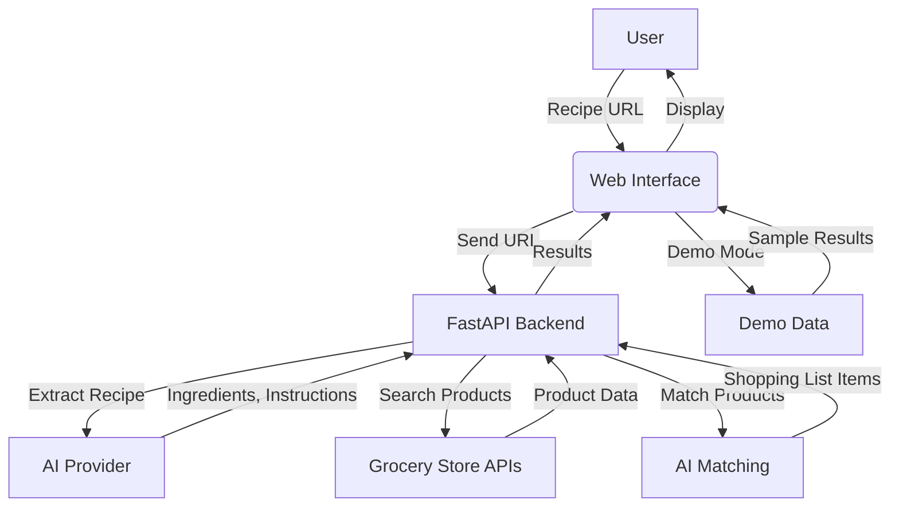

# How the AI Recipe Shoplist Project Works

This project is an intelligent web application that uses AI to analyze recipes, extract ingredients, and find matching products from multiple grocery stores. It combines Python backend services, AI providers, and a modern frontend to deliver a seamless shopping experience.

## System Overview

1. **User Input**: The user enters a recipe URL in the web interface.
2. **AI Extraction**: The backend uses an AI provider (OpenAI, Azure, Ollama, or GitHub Models) to intelligently extract ingredients, quantities, and instructions from the recipe webpage.
3. **Store Search**: The system queries configured grocery stores (Coles, Woolworths, ALDI, IGA) for products matching each ingredient.
4. **Product Matching**: AI matches extracted ingredients with available store products, considering price, quantity, and relevance.
5. **Results Display**: The frontend displays matched products, clickable store links, and a shopping list for the user.
6. **Demo Mode**: Users can try a demo with a sample recipe and real product data.

## Architecture Diagram

## Data Flow

1. **Input**: User provides a recipe URL.
2. **AI Extraction**: Backend sends the URL to the AI provider, which returns structured recipe data.
3. **Store Search**: For each ingredient, the backend queries store APIs or scrapers for matching products.
4. **Product Matching**: AI logic selects the best product for each ingredient.
5. **Frontend Display**: Results are shown in a responsive web interface, with direct links to products.

## Key Components

- **FastAPI Backend**: Handles API requests, recipe extraction, product search, and business logic.
- **AI Providers**: Extract recipe data and assist in product matching.
- **Grocery Store Integrations**: Search for products in real stores.
- **Frontend (HTML/JS)**: User interface for input and results.
- **Storage System**: Caches and stores data for performance and reliability.

## Example Workflow

1. User enters a recipe URL and clicks "Process Recipe".
2. Backend extracts ingredients using AI.
3. Backend searches stores for matching products.
4. AI matches products to ingredients.
5. Frontend displays shopping list with product links.

---

*For more details, see the README and documentation files in the project.*
